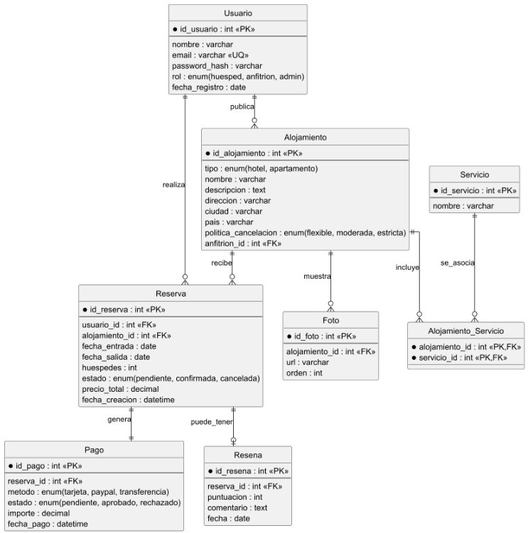

# ReservaUJA

Plataforma web de reservas de hoteles y apartamentos desarrollada como proyecto final de prácticas de la asignatura Desarrollo de Aplicaciones Web.

## Miembros del proyecto

- Ainhoa Piñar Amores
- Alberto Foronda Gimena
- Juan Jiménez Jaraba

## Descripción del proyecto

ReservaUJA es una plataforma web de reservas de hoteles y apartamentos centrada en alojamientos de Jaén y municipios destacados de la provincia.

La aplicación permite buscar alojamientos, filtrar resultados, consultar información detallada, visualizar imágenes y mapas, preparar reservas, dejar reseñas y administrar alojamientos y servicios desde una zona restringida.

En la iteración final se ha completado una versión funcional con persistencia en base de datos, autenticación de usuarios, administración de entidades, servicios REST y lógica de cliente con JavaScript y VueJS para validación dinámica de formularios, modificación del DOM, carga de datos mediante peticiones asíncronas y visualización enriquecida de alojamientos con imágenes y mapas.

## Historias de usuario

**HU1. Búsqueda de alojamientos**  
Como visitante, quiero buscar alojamientos por destino, fechas y huéspedes para ver disponibilidad.

**HU2. Filtrado de resultados**  
Como visitante, quiero filtrar resultados por precio, tipo de alojamiento y valoración para encontrar la mejor opción.

**HU3. Ficha detallada**  
Como visitante, quiero ver la ficha detallada de un alojamiento con imagen, servicios, ubicación y mapa para decidirme.

**HU4. Realizar una reserva**  
Como usuario, quiero preparar una reserva indicando mis datos, fechas, huéspedes y método de pago para consultar el precio final.

**HU5. Consultar reservas**  
Como usuario, quiero ver “Mis reservas” para consultar estado y detalles.

**HU6. Cancelar una reserva**  
Como usuario, quiero cancelar una reserva y consultar la política asociada.

**HU7. Dejar una reseña**  
Como usuario, quiero dejar una reseña tras mi estancia para valorar el alojamiento.

**HU8. Dar de alta un alojamiento**  
Como administrador, quiero dar de alta un alojamiento y editar sus datos.

**HU9. Gestionar alojamientos y servicios**  
Como administrador, quiero gestionar alojamientos, precios, capacidad y servicios disponibles.

## Storyboard

https://marvelapp.com/prototype/g79d28g/screen/98489136/handoff

## Diagrama entidad-relación



## Repositorio del proyecto

URL de la rama específica del repositorio del equipo con una versión estable del proyecto a la finalización de la iteración:

[Ver rama en GitHub](https://github.com/DAWUJA-2026/g1-equipo-102/tree/iteracion4)

## URLs públicas de despliegue

- Juan Jiménez Jaraba: http://35.202.241.213/app
- Ainhoa Piñar Amores: http://136.111.152.244/app
- Alberto Foronda Gimena: http://35.226.126.50/app

## Credenciales de acceso

La aplicación inicializa usuarios con distintos roles.

### Usuario administrador

Permite acceder a las vistas de administración.

- Email: `admin@reservauja.com`
- Contraseña: `admin1234`

### Usuario anfitrión

Usuario inicial con rol de anfitrión.

- Email: `host@reservauja.com`
- Contraseña: `host1234`

En la versión actual, las vistas de administración quedan restringidas al rol `ADMIN`.

## Estructura del proyecto

La versión final del proyecto está desarrollada con **Jakarta Faces (JSF/Facelets)** usando vistas `.xhtml`, layout dinámico mediante plantillas en `WEB-INF/template/` y fragmentos reutilizables en `WEB-INF/inc/`.

La aplicación sigue un enfoque basado en:

- vistas JSF / Facelets
- controladores / ViewModels
- entidades JPA
- interfaces DAO
- implementaciones DAO persistentes mediante Jakarta Data
- persistencia sobre base de datos relacional H2
- servicios REST implementados con Jakarta RESTful Web Services, JAX-RS
- lógica de cliente con JavaScript externo en `assets/js/`
- vista adicional desarrollada con VueJS
- peticiones asíncronas con `fetch`
- validación dinámica de formularios en cliente
- actualización dinámica del DOM
- visualización de alojamientos con imágenes y mapas mediante coordenadas

Framework CSS utilizado:

- Bootstrap 5 mediante CDN
- estilos propios en `src/main/webapp/assets/css/styles.css`

## Tecnologías utilizadas

- Java 21
- Jakarta EE 11
- Jakarta Faces / JSF
- Facelets
- CDI
- JPA
- Jakarta Data
- Bean Validation
- Jakarta RESTful Web Services, JAX-RS
- H2 Database
- Maven
- Payara
- Bootstrap 5
- JavaScript
- Fetch API
- VueJS
- OpenStreetMap embebido mediante iframe

## Organización principal de carpetas

```text
src/main/java/daw/app
├── AppConfig.java
├── JAXRSConfiguration.java
├── dao/
├── dao/jdata/
├── dao/mem/
├── dao/qualifier/
├── model/
├── rest/
├── security/
└── vm/

src/main/resources/META-INF
└── persistence.xml

src/main/webapp
├── index.xhtml
├── results.xhtml
├── details.xhtml
├── booking.xhtml
├── review.xhtml
├── myreservations.xhtml
├── login.xhtml
├── vue-alojamientos.xhtml
├── admin-alojamientos.xhtml
├── admin-alojamiento-form.xhtml
├── admin-servicios.xhtml
├── admin-servicio-form.xhtml
├── assets/
│   ├── css/styles.css
│   └── js/
└── WEB-INF/
    ├── inc/navbar.xhtml
    └── template/plantilla.xhtml

```

## Modelo de datos

La aplicación trabaja principalmente con las siguientes entidades:

- `Alojamiento`
- `Servicio`
- `AlojamientoServicio`
- `Usuario`

La entidad `Alojamiento` incluye información ampliada para la iteración final:

- nombre
- descripción
- tipo de alojamiento
- dirección
- ciudad
- precio por noche
- valoración media
- capacidad
- imagen principal mediante `fotoUrl`
- coordenadas geográficas mediante `latitud` y `longitud`

Además, el proyecto conserva clases de modelo relacionadas con la visión general de la aplicación, como `Reserva`, `Resena`, `Foto` y `Pago`.

## Persistencia y datos iniciales

La aplicación utiliza una base de datos relacional H2 configurada mediante un `DataSource` en `web.xml` y una unidad de persistencia JPA definida en `persistence.xml`.

La carga inicial de datos se realiza desde `AppConfig`, utilizando los DAOs persistentes de Jakarta Data.

Se inicializa un catálogo base con alojamientos distribuidos por Jaén y municipios destacados de la provincia. Cada alojamiento incluye información descriptiva, precio, capacidad, valoración, imagen y coordenadas para su visualización en mapa.

También se cargan:

- usuarios iniciales
- servicios iniciales
- relaciones entre alojamientos y servicios

## Autenticación y control de acceso

La aplicación incorpora autenticación mediante un formulario propio en `login.xhtml`.

El proceso de autenticación se gestiona con `AuthVM`, validando las credenciales contra `UsuarioDao`.

Al iniciar sesión correctamente, se almacenan en sesión los datos necesarios:

- email del usuario
- nombre del usuario
- rol del usuario

Las vistas de administración se protegen mediante `AdminGuardVM`, que comprueba que existe sesión activa y que el rol del usuario es `ADMIN`.

La barra de navegación se actualiza dinámicamente según la sesión:

- si no hay usuario autenticado, muestra Login
- si hay usuario administrador, muestra enlaces de administración
- si hay sesión activa, muestra el email y la opción de cerrar sesión

## Vistas públicas

### `index.xhtml`

Página principal de la aplicación.

Incluye:

- buscador de destino, fechas y huéspedes
- validación cliente con `search.js`
- resumen visual de búsqueda
- mapa real de la zona principal mediante OpenStreetMap
- acceso a resultados y reservas

### `results.xhtml`

Página de resultados.

Incluye:

- carga asíncrona de alojamientos desde `/api/alojamientos`
- renderizado dinámico de tarjetas
- imágenes de alojamientos
- filtros por precio, tipo y valoración
- ordenación por precio y valoración
- modificación dinámica del DOM mediante JavaScript

### `details.xhtml`

Página de detalle de alojamiento.

Incluye:

- imagen principal del alojamiento
- datos completos
- ubicación
- mapa real generado a partir de latitud y longitud
- servicios asociados
- enlaces a reserva y reseña enviando el identificador del alojamiento

### `booking.xhtml`

Página de reserva.

Incluye:

- carga del alojamiento real mediante `fetch`
- imagen y datos del alojamiento seleccionado
- validación dinámica de datos personales, email, teléfono, fechas, huéspedes y método de pago
- cálculo automático de noches
- cálculo del precio total
- cupón `UJA10`
- resumen final de reserva

### `review.xhtml`

Página de reseña.

Incluye:

- carga del alojamiento real mediante `fetch`
- imagen y datos del alojamiento seleccionado
- validación dinámica de puntuación y comentario
- contador de caracteres
- resumen final de reseña

### `vue-alojamientos.xhtml`

Vista adicional desarrollada con VueJS para cubrir la programación MVC en cliente.

Incluye:

- carga de alojamientos desde `/api/alojamientos`
- estado reactivo
- filtros por ciudad, tipo y precio máximo
- validación de filtros en cliente
- renderizado dinámico con VueJS
- uso de directivas como `v-model`, `v-if`, `v-for`, `@click`, `:src` y `:href`

## Vistas de administración

### `admin-alojamientos.xhtml`

Listado de alojamientos persistentes.

Permite:

- consultar alojamientos
- acceder a edición
- borrar alojamientos
- acceder al formulario de alta

### `admin-alojamiento-form.xhtml`

Formulario de alta y edición de alojamientos.

Incluye:

- validación JSF / Bean Validation
- selección de tipo
- precio
- capacidad
- valoración
- descripción
- selección de servicios asociados

### `admin-servicios.xhtml`

Listado de servicios persistentes.

Permite:

- consultar servicios
- acceder a edición
- borrar servicios
- crear nuevo servicio

### `admin-servicio-form.xhtml`

Formulario de alta y edición de servicios.

Incluye:

- nombre
- descripción
- validación en servidor

## API REST

La iteración final incorpora una API REST desarrollada con Jakarta RESTful Web Services bajo la ruta base `/api`.

La configuración se realiza con:

```java
@ApplicationPath("/api")
public class JAXRSConfiguration extends Application {
}
```

### Endpoints principales

#### Alojamientos

- `GET /api/alojamientos`  
  Devuelve el listado completo de alojamientos en formato JSON.

- `GET /api/alojamientos/{id}`  
  Devuelve el detalle de un alojamiento concreto.

- `POST /api/alojamientos`  
  Permite crear un alojamiento a partir de datos JSON validados con Bean Validation.

- `GET /api/alojamientos/{id}/servicios`  
  Devuelve los servicios asociados a un alojamiento.

#### Servicios

- `GET /api/servicios`  
  Devuelve el listado completo de servicios en formato JSON.

- `GET /api/servicios/{id}`  
  Devuelve el detalle de un servicio concreto.

- `POST /api/servicios`  
  Permite crear un servicio a partir de datos JSON validados con Bean Validation.

Además, se ha añadido un manejador de errores de validación mediante `ValidationExceptionMapper`, que devuelve respuestas JSON con los campos erróneos y sus mensajes correspondientes.

## Funcionalidades de cliente en Iteración 4

La iteración final incorpora programación en cliente mediante JavaScript externo, siguiendo la organización en ficheros independientes dentro de `src/main/webapp/assets/js/`.

### Ficheros JavaScript principales

- `utils.js`: funciones comunes para selección de elementos, validación visual, mensajes de error y cálculo de días.
- `search.js`: validación dinámica del formulario de búsqueda de la página inicial.
- `results.js`: carga asíncrona de alojamientos desde `/api/alojamientos`, filtrado dinámico por precio, tipo y valoración, ordenación y renderizado del listado en cliente.
- `details.js`: generación dinámica del mapa de cada alojamiento a partir de sus coordenadas.
- `booking.js`: carga del alojamiento seleccionado mediante `fetch`, validación dinámica del formulario de reserva, cálculo de noches, cupón de descuento y precio total.
- `review.js`: carga del alojamiento seleccionado mediante `fetch`, validación dinámica del formulario de reseña, contador de caracteres y generación de resumen en cliente.
- `home-map.js`: generación dinámica del mapa real de la portada mediante OpenStreetMap.
- `vue-alojamientos.js`: vista cliente basada en VueJS que consume el API REST de alojamientos, mantiene estado reactivo, filtra resultados y valida datos en cliente.

Estas funcionalidades permiten mostrar mensajes de error antes de enviar datos, modificar dinámicamente el DOM y actualizar vistas en cliente como resultado de intercambios de datos con el servidor.

## VueJS

Se ha añadido una vista específica con VueJS:

```text
/vue-alojamientos.xhtml
```

Esta vista no sustituye a las vistas principales JSF, sino que se integra como funcionalidad adicional para demostrar programación MVC en cliente.

La vista Vue:

- consume el API REST `/api/alojamientos`
- mantiene estado reactivo para el listado y los filtros
- filtra por ciudad, tipo y precio máximo
- valida datos en cliente
- renderiza tarjetas dinámicamente
- enlaza con la página de detalle normal de la aplicación

La plantilla Vue se define en `vue-alojamientos.js` para evitar conflictos entre las directivas Vue y el procesamiento XML de Facelets.

## Trabajo dirigido: Dashboard con Chart.js

En la rama específica de trabajo dirigido se ha integrado un dashboard analítico dentro de la zona de administración de ReservaUJA.

La vista añadida es:

```text
/admin-dashboard.xhtml
```

El dashboard está protegido mediante `AdminGuardVM`, por lo que solo puede acceder un usuario autenticado con rol `ADMIN`.

El panel utiliza **Chart.js** para generar gráficas en cliente a partir de datos persistentes de la aplicación. La preparación de datos se realiza desde `DashboardVM`, que consulta los DAOs persistentes de alojamientos, servicios y relaciones alojamiento-servicio.

La generación de las gráficas se realiza en:

```text
src/main/webapp/assets/js/admin-dashboard.js
```

El acceso al dashboard se ha integrado en la barra de navegación de administración, visible únicamente para usuarios con rol `ADMIN`.

### Indicadores incluidos

El dashboard muestra tarjetas resumen con:

- total de alojamientos
- total de servicios
- precio medio general
- valoración media general

También incluye las siguientes gráficas:

- distribución de alojamientos por tipo
- precio medio por tipo de alojamiento
- servicios más usados
- alojamientos por ciudad
- valoración media por alojamiento
- capacidad media por tipo
- precio por alojamiento

### Archivos principales añadidos

```text
src/main/java/daw/app/vm/DashboardVM.java
src/main/webapp/admin-dashboard.xhtml
src/main/webapp/assets/js/admin-dashboard.js
```

### Relación con el proyecto final

El dashboard se ha adaptado al estado final del proyecto, utilizando el catálogo ampliado de alojamientos, los servicios persistentes y las relaciones alojamiento-servicio almacenadas en la base de datos.

De esta forma, el trabajo dirigido queda integrado en la aplicación final y permite visualizar de forma gráfica información real del sistema desde la zona de administración.

## Mapas

La aplicación utiliza OpenStreetMap embebido mediante `iframe`.

Se muestran mapas en:

- la portada, con una vista general de la zona principal de alojamientos
- el detalle de cada alojamiento, usando sus coordenadas individuales

Cada alojamiento almacena:

- `latitud`
- `longitud`

A partir de esos datos, JavaScript genera dinámicamente la URL del mapa.

## Catálogo de alojamientos

La aplicación inicializa un catálogo base de alojamientos mediante `AppConfig`, cargando alojamientos distribuidos por Jaén y municipios destacados de la provincia.

Cada alojamiento incluye:

- nombre
- ciudad
- dirección
- descripción
- tipo de alojamiento
- precio por noche
- valoración media
- capacidad
- imagen principal
- coordenadas geográficas

Las coordenadas se utilizan para mostrar un mapa individual en la página de detalle de cada alojamiento.

## Alcance de la iteración 1

En esta iteración se implementó la primera estructura visual de la aplicación:

- plantilla Facelets `WEB-INF/template/plantilla.xhtml`
- fragmento reutilizable `WEB-INF/inc/navbar.xhtml`
- vistas iniciales:
    - `index.xhtml`
    - `results.xhtml`
    - `details.xhtml`
    - `booking.xhtml`
    - `review.xhtml`
    - `myreservations.xhtml`
    - `login.xhtml`
- primeros formularios y navegación entre páginas
- integración de Bootstrap y CSS propio

## Alcance de la iteración 2

En esta iteración se implementó una versión funcional con operaciones de alta, edición, borrado y listado de entidades de administración.

Se añadió:

- paquete de modelos
- entidad `Usuario`
- entidad `Foto`
- entidad `Servicio`
- entidad `Reserva`
- entidad `Pago`
- entidad `Resena`
- entidad `Alojamiento`
- entidad `AlojamientoServicio`
- DAO de alojamientos
- DAO de servicios
- ViewModels de administración
- vistas de administración de alojamientos
- vistas de administración de servicios
- formularios JSF con validación en servidor

## Alcance de la iteración 3

En esta iteración se implementó:

- persistencia permanente en base de datos relacional
- configuración de DataSource H2
- configuración JPA con unidad de persistencia
- implementación de DAOs sobre repositorios Jakarta Data
- autenticación de usuarios contra datos almacenados en servidor
- control de acceso a partes restringidas de la aplicación
- gestión CRUD de entidades persistentes
- gestión de la relación entre alojamientos y servicios
- visualización de alojamientos y detalles usando datos reales almacenados en base de datos

## Alcance de la iteración 4

En esta iteración final se ha implementado:

- configuración de JAX-RS para habilitar servicios REST bajo `/api`
- API REST para alojamientos y servicios
- consulta REST de servicios asociados a un alojamiento
- manejador JSON de errores de Bean Validation en servicios REST
- ampliación de la entidad `Alojamiento` con imagen y coordenadas
- ampliación del catálogo inicial con alojamientos distribuidos por Jaén y municipios destacados
- carga dinámica de alojamientos desde el cliente mediante `fetch`
- filtrado dinámico de resultados por precio, tipo y valoración
- ordenación de alojamientos en cliente
- visualización de imágenes en tarjetas de resultados
- visualización de imagen principal y mapa en detalle de alojamiento
- mapa real en la portada
- validación dinámica del formulario de búsqueda
- validación dinámica del formulario de reserva
- carga del alojamiento real en la página de reserva
- cálculo automático de noches y precio total de reserva
- validación dinámica del formulario de reseña
- carga del alojamiento real en la página de reseña
- contador de caracteres en reseñas
- sustitución de JavaScript embebido por ficheros externos en `assets/js/`
- corrección de la vista de reseñas para no depender de un bean inexistente
- login propio con sesión y validación contra `UsuarioDao`
- protección de vistas de administración mediante `AdminGuardVM`
- vista adicional con VueJS conectada al API REST
- revisión de textos finales y navegación
- actualización de documentación y changelog para la entrega final

## Manual básico de uso

### Página inicial

Desde la portada se puede preparar una búsqueda indicando:

- destino
- fecha de entrada
- fecha de salida
- número de huéspedes

El formulario valida los datos en cliente y muestra un resumen visual antes de acceder a resultados.

### Resultados

La página de resultados carga los alojamientos desde el API REST y permite:

- filtrar por precio máximo
- filtrar por tipo
- filtrar por valoración mínima
- ordenar resultados
- acceder al detalle de cada alojamiento

### Detalle de alojamiento

La ficha de detalle muestra:

- imagen principal
- nombre
- ciudad
- dirección
- descripción
- precio
- valoración
- capacidad
- servicios asociados
- mapa real
- acceso a reserva
- acceso a reseña

### Reserva

La página de reserva carga el alojamiento seleccionado y permite preparar una reserva introduciendo:

- nombre
- email
- teléfono
- fechas
- huéspedes
- método de pago
- cupón opcional

El precio total se calcula automáticamente.

### Reseña

La página de reseña carga el alojamiento seleccionado y permite preparar una reseña indicando:

- nombre opcional
- puntuación
- comentario

El formulario valida los datos en cliente y muestra un contador de caracteres.

### Administración

Para acceder a administración:

1. Entrar en Login.
2. Usar las credenciales de administrador.
3. Acceder a “Admin alojamientos” o “Admin servicios”.

Desde administración se pueden gestionar alojamientos y servicios persistentes.

## Notas sobre VueJS

La aplicación principal se mantiene integrada en Jakarta Faces, pero se ha añadido una vista específica con VueJS para demostrar la programación MVC en cliente.

No se ha desarrollado un frontend independiente separado con Vite o Vue CLI, ya que el proyecto final mantiene una arquitectura Jakarta Faces con integración progresiva de JavaScript cliente. La vista Vue se integra dentro de la aplicación y consume el mismo API REST que el resto de funcionalidades cliente.

## Estado final

La aplicación en la rama `iteracion4` constituye la versión final del proyecto, incorporando:

- interfaz pública completa
- administración de entidades
- persistencia en base de datos
- autenticación y control de acceso
- API REST
- JavaScript cliente
- VueJS
- mapas
- imágenes
- validación en cliente y servidor
- documentación actualizada
- dashboard analítico con Chart.js en la rama de trabajo dirigido